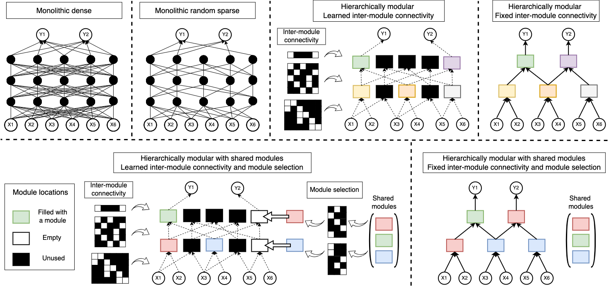

# When and how are modular networks better?

This repository is the official implementation of the paper titled "When and how are modular networks better?" under review at ICML 2025. 

Visualizations of architectures we explored in our paper




To install requirements run:

```setup
pip3 install -r requirements.txt
```

## Training commands

The code is divided into 4 directories, one for learning Boolean functions (boolean), the second to learn the MNIST based task (mnist), third for multi-task learning experiment and fourth for the experiments with module input size. To run the training scripts please move into the respective directories. 

### Training on Boolean functions

* An example command to run MLP training: 

```
python3 main.py --experiment generalization --num_tasks 1 --dataset_path ./datasets/generalization/ --result_path ./results/ --modularity 6 3 2 2  --dataset_noise True --dataset_split 0.5 --dataset_split_seed 40 --model mlp --arch 6 36 36 36 2 --pruning_ratio 0.0 --lr 0.1 --batch_size 64 --weight_decay 0.001 --epochs 1000 --seed 0 
```

* Running training for hierarchically modular NNs 
```
python3 main.py --experiment generalization --num_tasks 1 --dataset_path ./datasets/generalization/ --result_path ./results/ --modularity 6 3 2 2  --dataset_noise True --dataset_split 0.5 --dataset_split_seed 40 --model hierarchically_modular --num_modules 3 2 --module_arch 2 12 1 --topk 2 --tau 2.0 --lr 0.01 --lr_module_input 0.1 --batch_size 64 --weight_decay 0.001 --epochs 1000 --seed 0
```

* To run training for known routing simply add the following arguments: 
```
 --known_module_input
```
* To use Gumbel noise based structural sampling: 
```
 --use_gumbel --tau 1.0 --per_sample_routing
```
* Running training for hierarchically modular NNs with shared modules
```
python3 main.py --experiment generalization --num_tasks 1 --dataset_path ./datasets/generalization/ --result_path ./results/ --modularity 6 3 2 2  --dataset_noise True --dataset_split 0.5 --dataset_split_seed 40 --model hierarchically_modular_shared_modules --num_shared_modules 2 --num_slots 3 2 --module_arch 2 12 1 --topk 2 --tau 2.0 --lr 0.01 --lr_module_input 0.1 --lr_module_location 0.1 --batch_size 64 --weight_decay 0.001 --epochs 1000 --seed 0 
```
* To run training for known routing simply add the following arguments: 
```
 --known_module_input --known_module_locations
```
* To use Gumbel noise based structural sampling: 
```
 --use_gumbel --tau 1.0 --per_sample_routing
```

### Training on MNIST based task

* An example command to run MLP training: 

```
python3 main.py --modularity 2 2 3 2 2 --num_digits 8 --dataset_split_seed 40 --dataset_split 0.8 --num_samples_per_combination_train 1000 --num_samples_per_combination_test 100 --model mlp --arch 1568 256 128 36 36 36 36 2 --pruning_ratio 0.0 --lr 0.001 --batch_size 128 --weight_decay 0.001 --epochs 200 --seed 0
```

* Running training for hierarchically modular NNs 
```
python3 main.py --modularity 2 2 3 2 2 --num_digits 8 --dataset_split_seed 40 --dataset_split 0.8 --num_samples_per_combination_train 100 --num_samples_per_combination_test 100 --model hierarchically_modular_mlp --num_img_modules 2 --num_modules 3 2 --img_module_arch 784 128 64 3 --module_arch 2 12 1 --topk 2 --tau 0.5 --lr 0.01 --lr_module_input 0.01 --batch_size 128 --weight_decay 0.0001 --epochs 200 --seed 0
```
* To run training for known routing simply add the following arguments: 
```
 --known_module_input
```

* Running training for hierarchically modular NNs with shared modules
```
python3 main.py --modularity 2 2 3 2 2 --num_digits 8 --dataset_split_seed 40 --dataset_split 0.8 --num_samples_per_combination_train 1000 --num_samples_per_combination_test 100 --model hierarchically_modular_shared_modules_mlp --num_img_slots 2 --num_slots 3 2 --num_img_shared_modules 1 --num_shared_modules 2 --img_module_arch 784 128 64 3 --module_arch 2 12 1 --topk 2 --tau 0.5 --lr 0.01 --lr_module_input 0.01 --lr_module_location 0.01 --batch_size 128 --weight_decay 0.0001 --epochs 200 --seed 0

```
* To run training for known routing simply add the following arguments: 
```
 --known_module_input --known_module_locations
```


